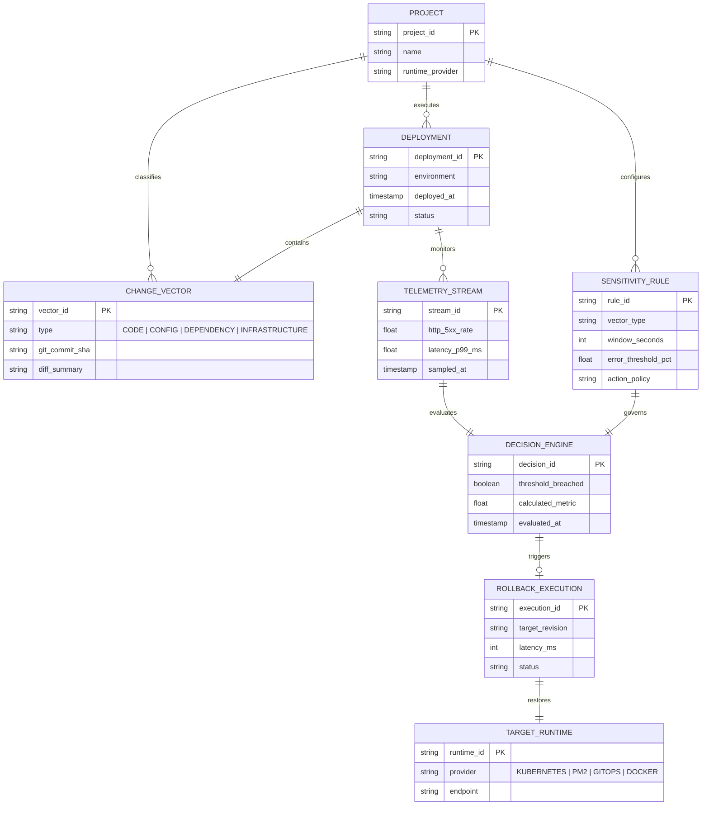

# CARF — Change-Aware Rollback Framework

CARF (Change-Aware Rollback Framework) is a hosted DevOps platform and execution engine that automates post-deployment verification and contextual rollback decisions. Unlike conventional continuous delivery systems that evaluate post-deploy telemetry against flat failure metrics, CARF inspects AST syntax trees and unified git diffs prior to telemetry ingestion. By classifying releases into application code, runtime configuration, dependency lockfiles, or infrastructure manifests, CARF dynamically synthesizes adaptive observation windows and error variance ceilings, preventing false-alarm rollbacks while ensuring instantaneous recovery during high-risk environment or system changes.

The framework integrates directly into existing continuous integration pipelines and cloud-native container orchestrators. Upon commit ingestion, CARF evaluates incoming metric streams from Prometheus, Datadog, or OpenTelemetry against configured vector sensitivity rules. When error rates or latency anomalies cross a vector's mathematical threshold, CARF dispatches zero-downtime rollback primitives to target controllers such as Kubernetes, PM2, Docker Swarm, or GitOps operators in under 500 milliseconds.

## Entity-Relationship Diagram

